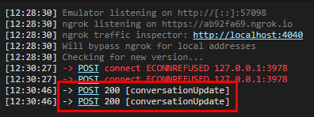
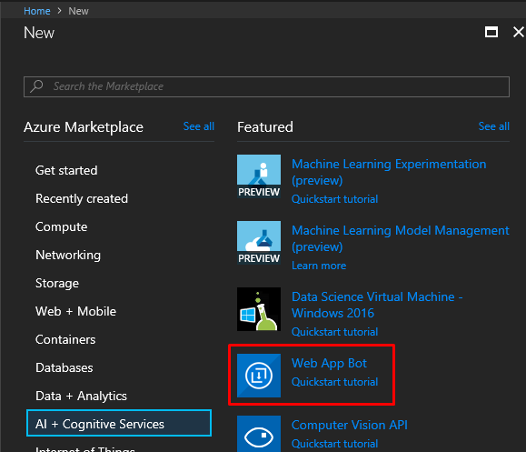
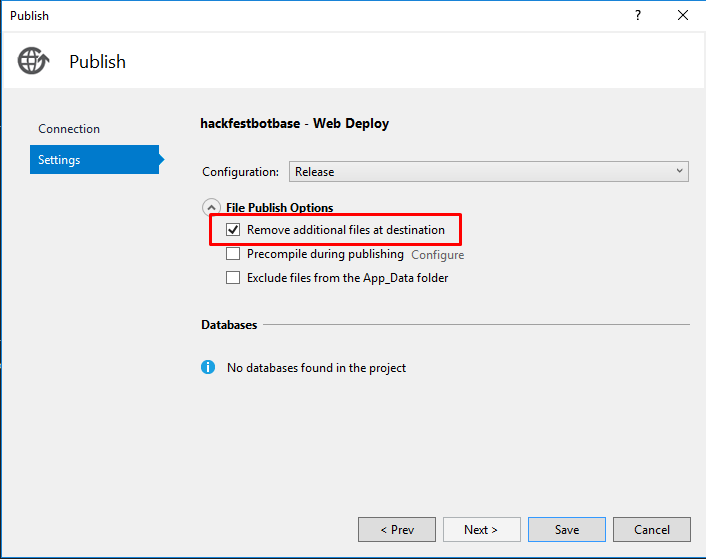
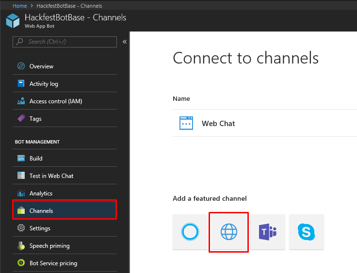

# Introduction 

# Getting started
1. Ensure you have Visual Studio 2017 installed.
2. Download the base solution from [here](https://intergen1-my.sharepoint.com/:f:/g/personal/openders_intergen_org_nz/Et7L8EqkBWxCk6pK78_8UrUBgeKqr1vaoywMF38NjKxTEw). _Suggestion: create a git repository and host it somewhere to collaborate and track changes._
3. Open the solution
4. Right click on the solution > Restore nuget packages
5. Build solution
6. Start debugging the API project (F5)
7. Open the Bot Emulator
8. Navigate to http://localhost:3978/api/messages and press connect.

## Test locally with the Bot Emulator
1. Install the bot emulator using the instructions [here](https://github.com/Microsoft/BotFramework-Emulator/wiki/Getting-Started).
2. Once your project has started, open the bot emulator, navigate to http://localhost:3978/api/messages and press connect.

3. If successful, you should see 200 in the bot emulator logs.

4. **SAY HI!**

# Set up Azure Environment
We will set up a Web App Bot as a base.

Enter a bot name, and the remaining fields should automatically populate. Use the Basic C# bot template if using the Hackfest starter project. ([MSDN](https://docs.microsoft.com/en-us/azure/bot-service/bot-service-quickstart))

# Publish
Follow the steps below to deploy to Azure.

Select the app service created when you created the bot resource.

Make sure to republish after changing settings.

## Configure Channels

MSDN documentation for configuring channels, speech priming etc [here](https://docs.microsoft.com/en-us/azure/bot-service/bot-service-manage-channels).

### DirectLine

Republish, and then you can navigate to https://your-bot-name.azurewebsites.net/ to use the chatbox.

You can also navigate to http://localhost:3979/default.htm to view the same page, although the bot will still be connected to the deployed version in Azure. To debug a local version of the bot, use the bot emulator.