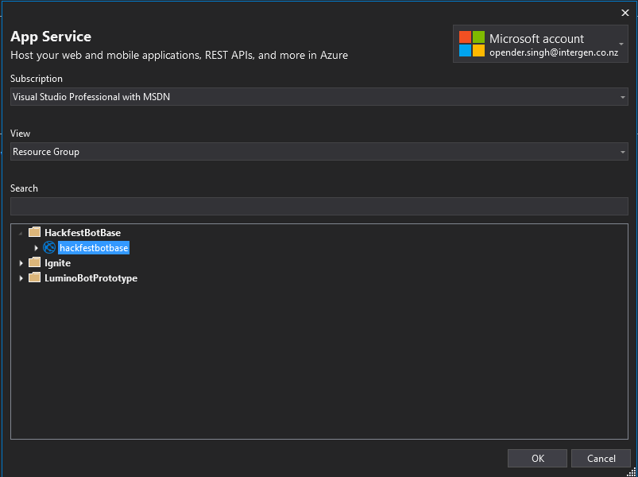
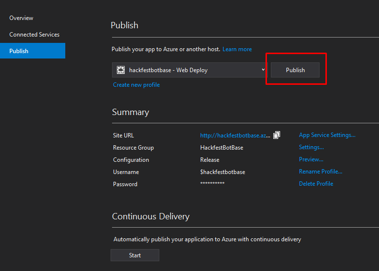

# Introduction 
Microsoft has a barebones C# starter project for bots, however it can require some plumbing to get running properly. By all means, if you wish to use one of those example projects, you can. For the purposes of the Hackfest, I have extracted patterns and helpers developed and used in a very recent bot.

I have also added a conversation to demonstrate how a conversation may flow, employing some of the helpers included in the [HackfestBotBase](https://intergen1-my.sharepoint.com/:f:/g/personal/openders_intergen_org_nz/Et7L8EqkBWxCk6pK78_8UrUBgeKqr1vaoywMF38NjKxTEw).

## Demo

The purpose is to identify the users name and persist it. If the name is already saved, the user is not asked and it loads from memory. It then prompts the user to type a phrase, provides suggested responses, and uses the response to determine the next step. This demo implemented in `dialogs/DemoDialog.cs` of the HackfestBotBase incorporates all of the bot concepts and features described before, and serves as an example. You can experiment with it [here](https://hackfestbotbase.azurewebsites.net/).

# Get started
1. Ensure you have Visual Studio 2017 installed.
2. Download the base solution from [here](https://intergen1-my.sharepoint.com/:f:/g/personal/openders_intergen_org_nz/Et7L8EqkBWxCk6pK78_8UrUBgeKqr1vaoywMF38NjKxTEw). _Suggestion: create a git repository and host it somewhere to collaborate and track changes._
3. Open the solution
4. Right click on the solution > Restore nuget packages
5. Build solution
6. Start debugging the API project (F5)
7. Open the Bot Emulator
8. Navigate to http://localhost:3978/api/messages and press connect.

## Test locally with the Bot Emulator
1. Install the bot emulator using the instructions [here](https://github.com/Microsoft/BotFramework-Emulator/wiki/Getting-Started).
2. Once your project has started, open the bot emulator, navigate to http://localhost:3978/api/messages and press connect.


3. If successful, you should see 200 in the bot emulator logs.


4. **SAY HI!**


# Bot Concepts

# Features of the HackfestBotBase
All of the features below, posting and recieving messages, and handling basic conversation flow, are implemented in the `DemoDialog.cs` example class. When you first run the project, this is the dialog that will power the conversation.

This is built on top of the base bot project by Microsoft, so all of the documentation on MSDN is still relevant. However some patterns and helpers have been developed while building another prototype and developing internal IP, which are included within this project.

**_This is one of the first iterations of the internal base project, and it will improve over time._**

## Data storage helpers
The bot framework has three data stores.
- `User`: data associated with a specific user (across all channels and conversations)
- `Conversation`: data associated with a specific conversation with a specific user
- `PrivateConversation`: data associated with a specific user within the context of a specific conversation

These are stored in an in-memory store, but if you set the `AzureWebJobsStorage` config value, it will use Table Storage. This is automatically configured once you deploy to Azure, but locally the in-memory store will be used.

These are key-value stores and can get unwieldy to manage when data is written to one store with a certain key, and read from a different store with a different key. This can especially happen when there are many key-value pairs being stored. It is welcoming bugs and is a trigger for rip-your-hair-out syndrome.

There are two main classes that enable a cleaner method of managing the data stores. 
- `models/DataStoreKey.cs` is an enum, defining keys for the key-value pairs. Each enum value has an attribute identifying the data store to use (User, Conversation, PrivateConversation)
- `services/BotDataService.cs` contains logic pertaining to reading and writing from the data store

The implementation in the `BotDataService.cs` and `SetValue()`/`GetValueOrDefault()` extension methods ensure data is read/written against the correct key in the correct store, and is used as per the examples below. In order to use this bot service, inject the interface `IBotDataService` to your class.

```cs
public enum DataStoreKey
{
    [DataStoreEntry("Preferred name", DataStore.User)]
    PreferredFirstName
}
```
```cs
// Snippet from class BotDataService
...
public void SetPreferredName(IBotData botData, string name) 
{
    botData.SetValue(DataStoreKey.PreferredFirstName, name);
}

public string GetPreferredName(IBotData botData) 
{
    return botData.GetValueOrDefault<string>(DataStoreKey.PreferredFirstName);
}
...
```
## Autofac/IoC
A conversation and all of its instances/resources will get serialized and saved to the data store by the bot framework, so when creating services to integrate with the bot, we need to ensure they don't get serialized and are resolved each time. Serialization can cause unnecessary issues.

When registering a service with Autofac, use the the `FiberModule.Key_DoNotSerialize` key. 
```cs
builder.RegisterType<MessageService>()
    .Keyed<IMessageService>(FiberModule.Key_DoNotSerialize)
    .AsImplementedInterfaces()
    .InstancePerLifetimeScope();
```

Use the examples in the `IoC` folder for registrations.

## Dialog builder
The dialog builder simplifies resolution of a dialog through an Autofac registration. Because of the way Autofac requires the creation of a lifetimescope each time a registered services needs to be resolved, the code can get cluttered with unnecessary plumbing. 

For this reason, all logic pertaining to dialog creation/resolution should be contained within the `dialogs/DialogBuilder.cs` class. 

Use the example implementations and notes in the files below.
- IoC registration: `IoC/ApplicationDialogsModule.cs`
- IoC resolution: `dialogs/DialogBuilder.cs`
- Usage: `dialogs/DemoDialog.cs`

As in the examples below, the CreateDialog method handles all the lifetime scope creation/deletion duties when resolving an instance.

#### Example: Register and resolve dialog without no custom parameters
```cs
// Snippet from DialogBuilder.cs
public NameDialog BuildNameDialog(IMessageActivity message)
{
    return CreateDialog(message, scope => scope.Resolve<NameDialog>());
}
```
```cs
// Snippet from NameDialog.cs
...
private readonly IBotDataService _botDataService;

public NameDialog(IBotDataService botDataService)
{
    SetField.NotNull(out _botDataService, nameof(botDataService), botDataService);
}
...
```
```cs
// Snippet from ApplicationDialogsModule.cs
...
builder.RegisterType<NameDialog>().AsSelf().InstancePerDependency();
...
```
#### Example: Register and resolve dialog with custom parameters
```cs
// Snippet from DialogBuilder.cs
public ShowSuggestedActionsDialog BuildShowSuggestedActionsDialog(IMessageActivity message, string prompt, List<string> options)
{
    return CreateDialog(message, scope => scope.Resolve<ShowSuggestedActionsDialog>(TypedParameter.From(prompt), TypedParameter.From(options)));
}
```
```cs
// Snippet from ShowSuggestedActionsDialog.cs
...
private readonly IMessageService _messageService;

public ShowSuggestedActionsDialog(string prompt, List<string> options, IMessageService messageService)
{
    SetField.NotNull(out _messageService, nameof(messageService), messageService);
    SetField.NotNull(out _options, nameof(options), options);
    SetField.NotNull(out _prompt, nameof(prompt), prompt);
}
...
```
```cs
// Snippet from ApplicationDialogsModule.cs
...
builder.Register((c, p) =>
    new ShowSuggestedActionsDialog(
        p.TypedAs<string>(),
        p.TypedAs<List<string>>(),
        c.Resolve<IMessageService>()))
    .AsSelf()
    .InstancePerDependency();
...
```

## Message service
The purpose of this service is to send multiple messages from the bot to the user. This helper service will split a string into separate chat messages, using newline character `\n` in the original string.

For example, `_messageService.PostAsync("Hello!\nI'm on a new line!");` will send messages as shown in the following image.


Reading separate concise messages is nicer than reading a big paragraph, in a conversational context. Think about how to effectively communicate using shorter messages.

# Set up Azure Environment
We will set up a Web App Bot as a base.


Enter a bot name, and the remaining fields should automatically populate. Use the Basic C# bot template if using the Hackfest starter project. ([MSDN](https://docs.microsoft.com/en-us/azure/bot-service/bot-service-quickstart))


# Publish
Follow the steps below to deploy to Azure.


Select the app service created when you created the bot resource.




Make sure to republish after changing settings.


## Configure Channels

MSDN documentation for configuring channels, speech priming etc [here](https://docs.microsoft.com/en-us/azure/bot-service/bot-service-manage-channels).

### DirectLine


Republish, and then you can navigate to https://your-bot-name.azurewebsites.net/ to use the chatbox.

You can also navigate to http://localhost:3979/default.htm to view the same page, although the bot will be connected to the deployed version in Azure. To debug a local version of the bot, use the bot emulator.

# Gotcha
- Is each dialog class taggged with the `[Serializable]` attribute?
- Do the service registrations have the `FiberModule.Key_DoNotSerialize` key added? 
```cs
builder.RegisterType<MessageService>()
    .Keyed<IMessageService>(FiberModule.Key_DoNotSerialize)
    .AsImplementedInterfaces()
    .InstancePerLifetimeScope();
```